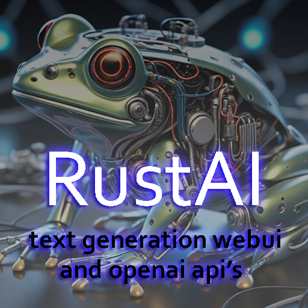

# RustAI
The RustAI Oxide plugin integrates AI generative models into Rust servers, supporting both Text Generation WebUI for custom local models and OpenAI models, simultaneously.
Admins can switch between models using a command or via the configuration file. The plugin includes per-user and global cooldowns to prevent spam and/or overwhelming the model.
 

Installation Instructions:

Place the "RustAI.cs" file in the Oxide plugins directory
Edit the config file at oxide/config/RustAI.json
Reload the plugin with o.reload RustAI
 

Configuration:

Open the server's configuration file at oxide/config/RustAI.json.

Adjust settings such as API URLs, wakewords (like wipe or admin), cooldowns, and model types.

To use with OpenAI, just enter your OpenAI API Key.
Al base configurations and urls are pre entered.

To use with Text Generation WebUI, first you need a local model running with the api extension.
Then enter the IP in TextGenerationApiUrl field. Ports and urls are already entered with the default values.

Permissions:

Grant the "rustai.use" permission to players for AI interaction.

Grant the "rustai.switchmodel" permission to admins for model switching.
 

Activating the AI:

Players with "rustai.use" permission trigger the AI by mentioning wakewords in the conversation (case insensitive). They can be defined in the config file.

The AI model responds based on the provided prompt and the message.
 

Switching AI Models:

Users with "rustai.switchmodel" permission use "/switchmodel" to toggle between Text Generation WebUI and OpenAI models.

Users receive confirmation messages and the plugin automatically saves the updated configuration.

Feel free to try it, comment and suggest ideas for it.

 

